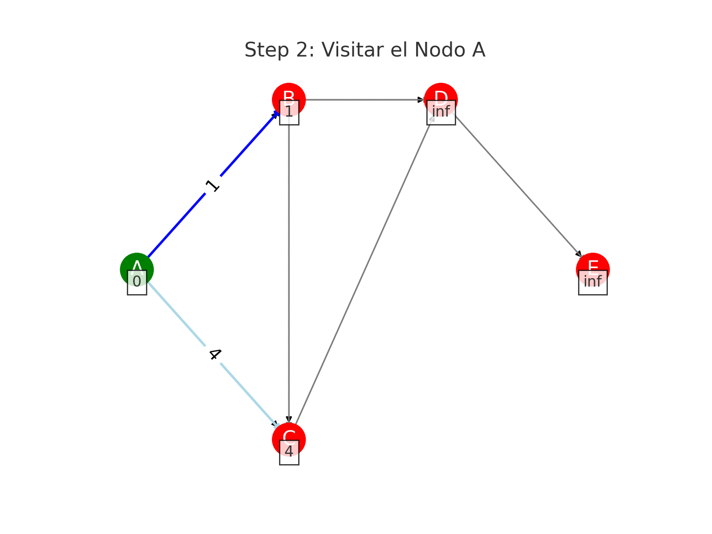

# Graph Routing Library

This Dart library provides functionalities for detecting the shortest path in a graph using Dijkstra's algorithm. The library is designed to handle complex routing problems, making it suitable for applications in transportation networks, geographical information systems, and other areas where pathfinding is crucial.

## Features

- **Graph Representation:** Efficient graph representation using nodes and edges.
- **Shortest Path Calculation:** Implementation of Dijkstra's algorithm to find the shortest path between nodes.
- **File Handling:** Utilities to read graph data from files.
- **Geospatial Utilities:** Functions to handle geospatial data.
- **Routing Service:** High-level service to manage routing operations.

## Dijkstra's Algorithm
Dijkstra's algorithm is a well-known algorithm for finding the shortest path between nodes in a graph, which may represent, for example, road networks. The algorithm works as follows:

**Initialization:**

Set the distance to the start node to zero and to all other nodes to infinity.
Mark all nodes as unvisited. Set the initial node as current.
Visit the Current Node:

For the current node, consider all of its unvisited neighbors and calculate their tentative distances through the current node.
Compare the newly calculated tentative distance to the current assigned value and assign the smaller one.
After considering all of the neighbors of the current node, mark the current node as visited. A visited node will not be checked again.
Select the Next Current Node:

Select the unvisited node with the smallest tentative distance and set it as the new "current node," then go back to step 2.
If the smallest tentative distance among the unvisited nodes is infinity (when there is no connection between nodes), the algorithm stops.
Terminate:

The algorithm terminates when the destination node has been marked visited (when planning a route between two specific nodes) or when the smallest tentative distance among the unvisited nodes is infinity (when planning a complete traversal; occurs when there is no connection between remaining unvisited nodes).
Example
Here is a visual representation of Dijkstra's algorithm finding the shortest path in a graph

** Example **

### Ejemplo

### Paso 1: Inicialización


### Paso 2: Visitar el Nodo A


### Paso 3: Visitar el Nodo B


### Paso 4: Visitar el Nodo C


### Paso 5: Visitar el Nodo D


### Paso 6: Visitar el Nodo E


### GIF


El camino más corto desde A hasta E es A -> B -> C -> D -> E con una distancia total de 7.

## Installation

Add this to your package's `pubspec.yaml` file:

```yaml
dependencies:
  graph_routing:
    git:
      url: https://github.com/yourusername/graph_routing.git
      ref: main

