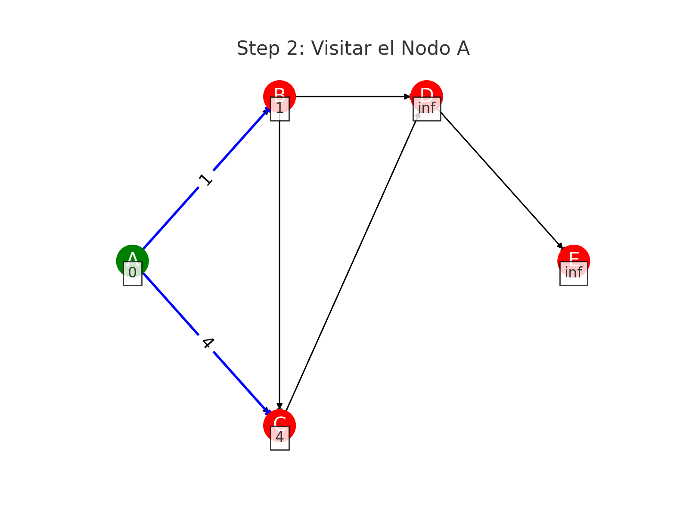
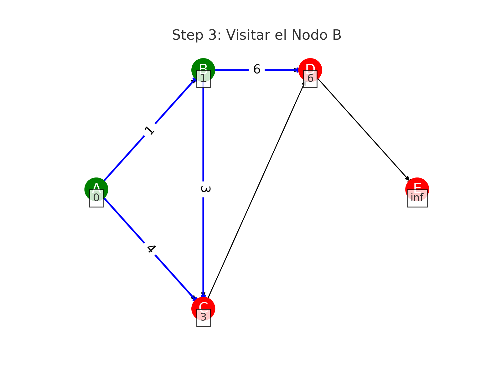
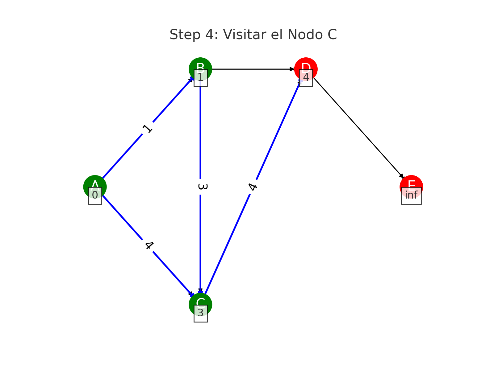
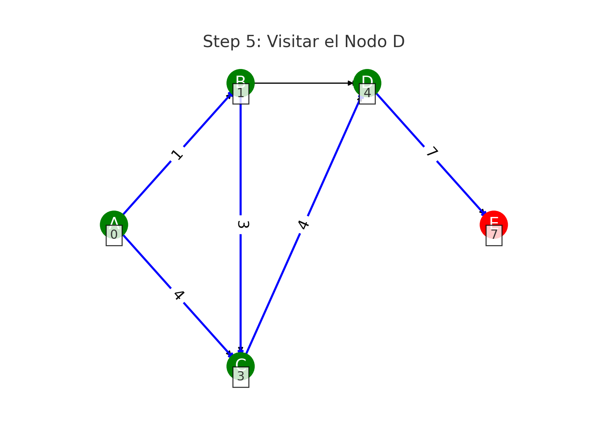
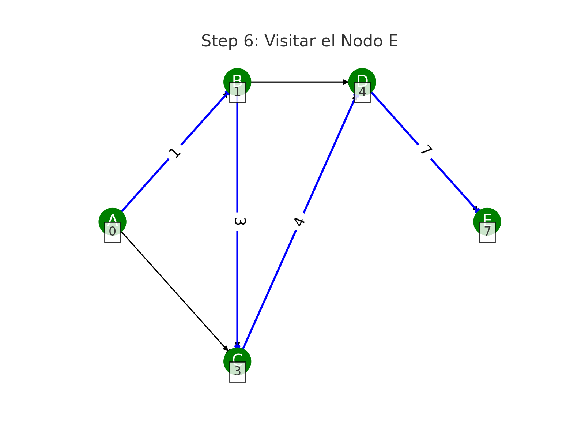
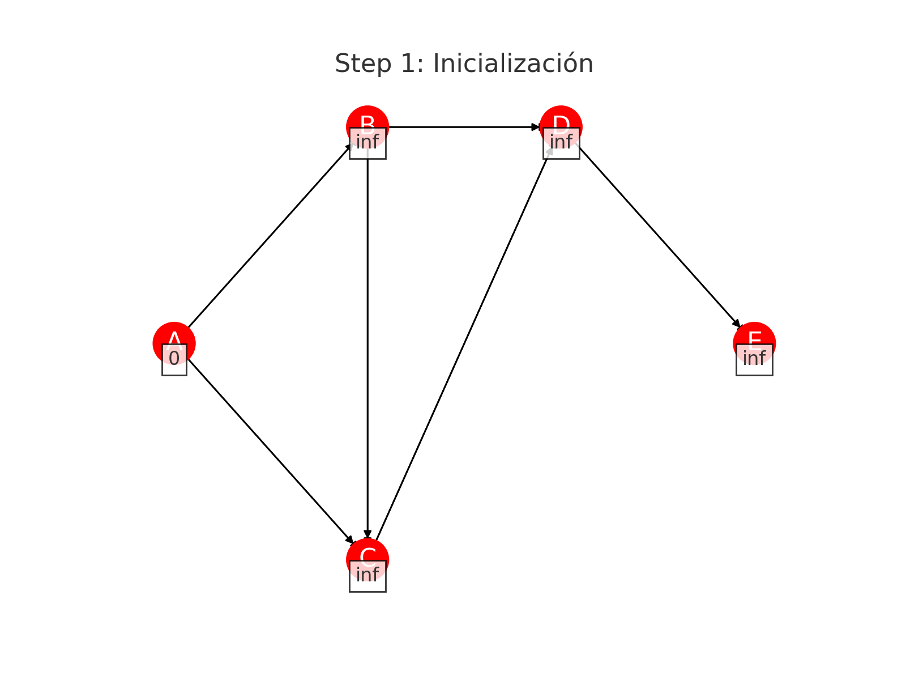

### README (Español)

```markdown
# Librería de Enrutamiento de Grafos

Esta librería de Dart proporciona funcionalidades para detectar la ruta más corta en un grafo utilizando el algoritmo de Dijkstra. La librería está diseñada para manejar problemas de enrutamiento complejos, siendo adecuada para aplicaciones en redes de transporte, sistemas de información geográfica y otras áreas donde la búsqueda de rutas es crucial.

## Características

- **Representación de Grafos:** Representación eficiente de grafos usando nodos y aristas.
- **Cálculo de la Ruta Más Corta:** Implementación del algoritmo de Dijkstra para encontrar la ruta más corta entre nodos.
- **Manejo de Archivos:** Utilidades para leer datos de grafos desde archivos.
- **Utilidades Geoespaciales:** Funciones para manejar datos geoespaciales.
- **Servicio de Enrutamiento:** Servicio de alto nivel para gestionar operaciones de enrutamiento.

## Algoritmo de Dijkstra
El algoritmo de Dijkstra es un algoritmo bien conocido para encontrar el camino más corto entre nodos en un grafo, que puede representar, por ejemplo, redes de carreteras. El algoritmo funciona de la siguiente manera:

**Inicialización:**

Establecer la distancia al nodo inicial en cero y a todos los demás nodos en infinito.
Marcar todos los nodos como no visitados. Establecer el nodo inicial como el nodo actual.
Visitar el Nodo Actual:

Para el nodo actual, considerar todos sus vecinos no visitados y calcular sus distancias tentativas a través del nodo actual.
Comparar la distancia recién calculada con el valor asignado actualmente y asignar el menor.
Después de considerar todos los vecinos del nodo actual, marcar el nodo actual como visitado. Un nodo visitado no será revisado nuevamente.
Seleccionar el Próximo Nodo Actual:

Seleccionar el nodo no visitado con la menor distancia y establecerlo como el nuevo "nodo actual", luego regresar al paso 2.
Si la menor distancia entre los nodos no visitados es infinito (cuando no hay conexión entre los nodos), el algoritmo se detiene.
Terminar:

El algoritmo termina cuando el nodo de destino ha sido marcado como visitado (al planear una ruta entre dos nodos específicos) o cuando la menor distancia entre los nodos no visitados es infinito (al planear un recorrido completo; ocurre cuando no hay conexión entre los nodos no visitados restantes).

### Ejemplo

#### Paso 1: Inicialización


#### Paso 2: Visitar el Nodo A


#### Paso 3: Visitar el Nodo B


#### Paso 4: Visitar el Nodo C


#### Paso 5: Visitar el Nodo D


#### Paso 6: Visitar el Nodo E


### GIF Completo


El camino más corto desde A hasta E es A -> B -> C -> D -> E con una distancia total de 7.

## Instalación

Añade esto a tu archivo `pubspec.yaml`:

```yaml
dependencies:
  graph_routing:
    git:
      url: https://github.com/yourusername/graph_routing.git
      ref: main
